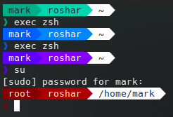

An easier way to share my `zsh` config. If you want to use this, you will need to follow some instructions in `.zsh/05-prompt.zsh` to either get the gitstatus working or disable it all together.

**Example:**

