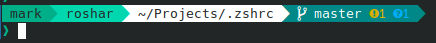

```
                ██
               ░██
 ██████  ██████░██      ██████  █████
░░░░██  ██░░░░ ░██████ ░░██░░█ ██░░░██
   ██  ░░█████ ░██░░░██ ░██ ░ ░██  ░░
  ██    ░░░░░██░██  ░██ ░██   ░██   ██
 ██████ ██████ ░██  ░██░███   ░░█████
░░░░░░ ░░░░░░  ░░   ░░ ░░░     ░░░░░
```

My `zsh` config. This is not made ready for use by others, this is as I currently use it. If you want to use it, you'll have to make the changes listed below. I stole my initial config from [someone](https://github.com/phat-sumo/dots/tree/master/zsh/.zsh) who stole theirs from [someone else](https://github.com/xero/dotfiles) before eventually overhauling most of it (see also: lots of commented out stuff) and spending too many nights at 3 am reading documentation on sites that haven't been updated in two decades.

## Example





## How to Install and Customize

### Acquisition

1. Clone the directory to your home folder (or download it as a zip and extract it there).
2. All of the files will probably be in a `.zshrc` folder, and need to be moved to the root of your home directory; because there is a file called `.zshrc`, you may need rename the cloned directory first.
3. I would **strongly** recommend deleting the `.git` folder.

### Modify `.zshrc`

1. Change the sourcing for the `gitstatus` plugin to reference your home directory. The reason this uses an absolute path as opposed to `~` is so that root can reference it too.

### Prompt Stuff

`.zsh/05-prompt.zsh`

1. Follow the instructions at the beginning of the `ICONS` section if you want to have icons in the gitstatus and don't already have a nerd font installed.
    1. You can (un)comment icons that you would prefer to use.
2. Change the colors/hostname(s) in `COLORS` to suite your liking. [The color reference can be found here (it's also at the beginning of the `COLORS` section)](https://www.ditig.com/256-colors-cheat-sheet).
3. [Install the `gitstatus` plugin](https://github.com/romkatv/gitstatus).
    1. Clone the repo in your home directory.
    2. If you don't want it to be visible, you can add `gitstatus` to a `.hidden` file in your home directory, which hides listed files/directories from your file browser (it functions similar to a `.gitignore`). Alternatively, you can change where it lives and change the path you're sourcing it from in the previous section.

### Aliases

`.zsh/06-aliases.zsh`

1. I'd recommend deleting everything in custom (since it's stuff that's fairly specific to me).
2. Add any aliases you want (obviously).

### Misc.

- Remove `.zsh/z_misc.zsh`. This is mostly temporary stuff I've added for university courses and the like.
- (optional) If you want to use the same config for the `root`, I'd recommend symlinking `.zshrc` and the `.zsh` directory to `/root`.

---

If you have any issues, there's a non-zero amount of documentation in the files. Good luck :v:
